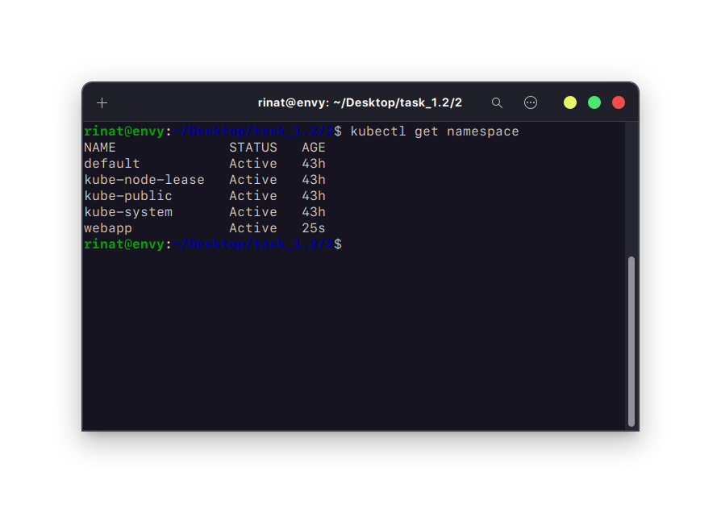
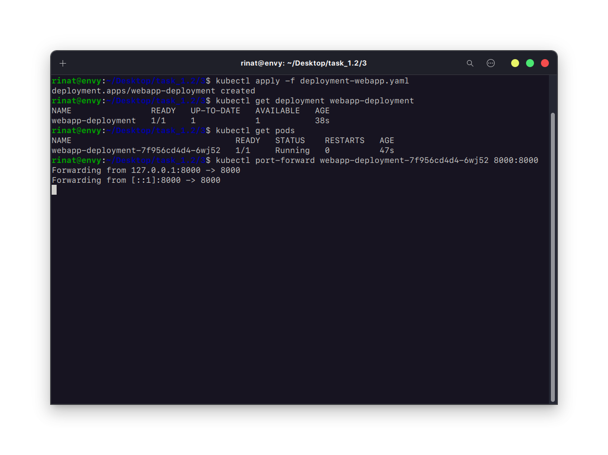
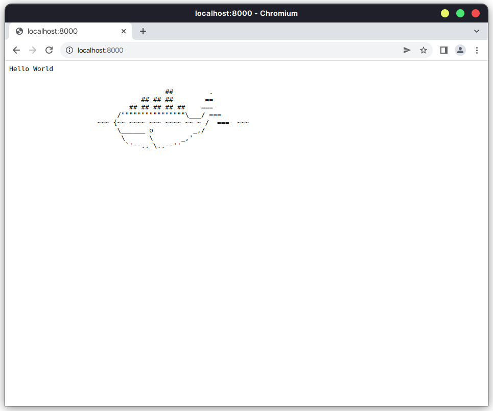
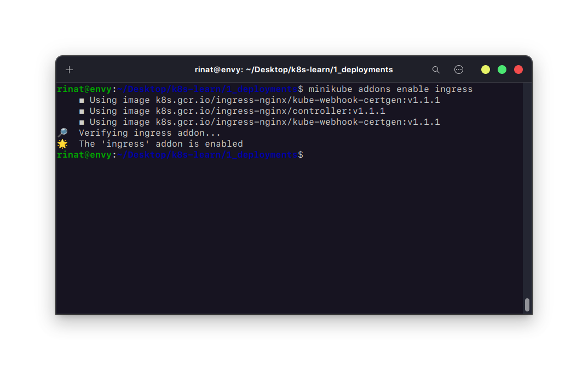
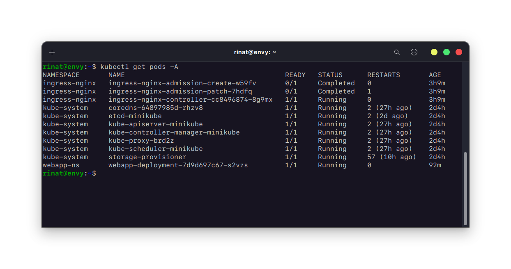
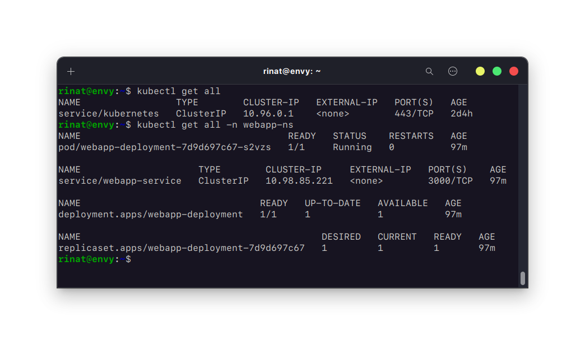

## 1.2 Работа с Kubernetes

### 1. Установите minikube согласно инструкции на официальном сайте.

#_Установил по инструкции на официальном сайте `https://kubernetes.io/ru/docs/tasks/tools/install-minikube/`_

### 2. Создайте namespace для деплоя простого веб приложения.

#_Создаем объект namespace_

> ```
> apiVersion: v1
> kind: Namespace
> metadata:
>   name: webapp-ns
> ```



### 3. Напишите deployments файл для установки в Kubernetes простого веб приложения, например `https://github.com/crccheck/docker-hello-world`.

#_Deployment веб-приложения_

> ```
> apiVersion: apps/v1
> kind: Deployment
> metadata:
>   name: webapp-deployment
>   namespace: webapp-ns
>   labels:
>     app: webapp
> spec:
>   replicas: 1
>   selector:
>     matchLabels:
>       app: webapp
>   template:
>     metadata:
>       labels:
>         app: webapp
>     spec:
>       containers:
>       - name: webapp-container
>         image: crccheck/hello-world
>         ports:
>         - containerPort: 8000
> ```

#_Запуск веб-приложения_


#_Результат_


### 4. Установите в кластер `ingress` контроллер.

> `minikube addons enable ingress`



### 5. Напишите и установите `Ingress rule` для получения доступа к своему приложению. В качестве результата работы сделайте скриншоты результата выполнения команд:

> ```
> apiVersion: networking.k8s.io/v1
> kind: Ingress
> metadata:
>   name: webapp-ingress
>   namespace: webapp-ns
> spec:
>   rules:
>   - host: webapp.loc
>     http:
>       paths:
>       - path: /
>         pathType: Prefix
>         backend:
>           service:
>             name: webapp-service
>             port:
>               number: 3000
> ```

> `kubectl get pods -A`\
> 

> `kubectl get svc`\
> 

> `kubectl get all`\
> 

### а также все написанные вами фалы конфигурации

#_Файлы конфигураций находятся в соответствующих папках subtask_
