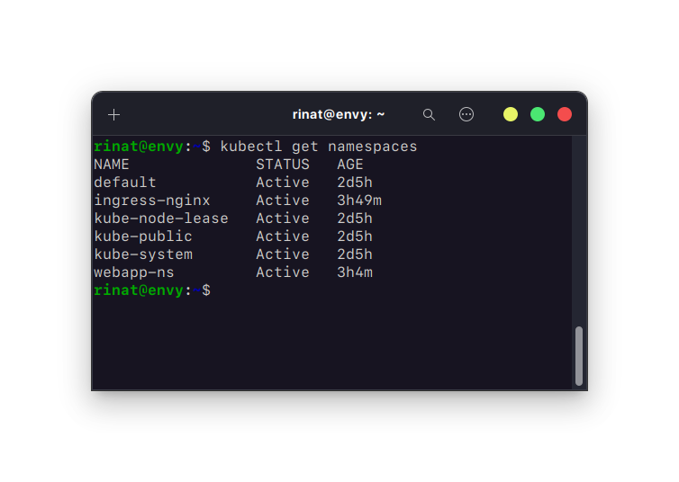

## 1.2 Работа с Kubernetes

### 1. Установите minikube согласно инструкции на официальном сайте.

#_Установил по инструкции на официальном сайте `https://kubernetes.io/ru/docs/tasks/tools/install-minikube/`_

### 2. Создайте namespace для деплоя простого веб приложения.

#_Создаем объект namespace_

> ```
> apiVersion: v1
> kind: Namespace
> metadata:
>   name: webapp
> ```



### 3. Напишите deployments файл для установки в Kubernetes простого веб приложения, например `https://github.com/crccheck/docker-hello-world`.

#_Deployment веб-приложения_

> ```
> apiVersion: apps/v1
> kind: Deployment
> metadata:
>   name: webapp-deployment
>   labels:
>     app: webapp
> spec:
>   replicas: 1
>   selector:
>     matchLabels:
>       app: webapp
>   template:
>     metadata:
>       labels:
>         app: webapp
>     spec:
>       containers:
>       - name: simple-webapp
>         image: crccheck/hello-world
>         ports:
>         - containerPort: 8000
> ```

#_Запуск веб-приложения_


#_Результат_


### 4. Установите в кластер `ingress` контроллер.

### 5. Напишите и установите `Ingress rule` для получения доступа к своему приложению. В качестве результата работы сделайте скриншоты результата выполнения команд:

### `kubectl get pods -A`

### `kubectl get svc`

### `kubectl get all`

### а также все написанные вами фалы конфигурации

```

```

```

```
